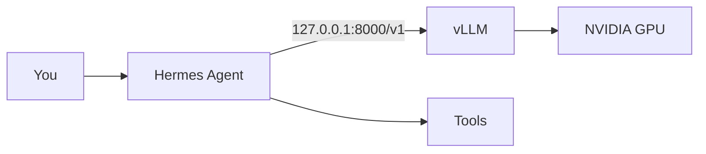
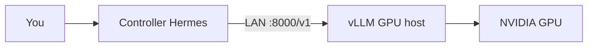

# Enodios

**Ἐνόδιος — Hermes of the road.** One-script Linux setup for [Hermes Agent](https://github.com/NousResearch/hermes-agent) on **your GPU** via [vLLM](https://github.com/vllm-project/vllm).

Local inference. Fast tool calling. No cloud API keys.

**Documentation:** https://dataknifeai.github.io/enodios/

---

## Overview

Enodios installs vLLM, tunes it for Hermes 3 (64k context, tool parser), and wires Hermes to `http://127.0.0.1:8000/v1`.

**Install order:** Enodios → start vLLM → Hermes Agent → `hermes setup`.

Default model: `solidrust/Hermes-3-Llama-3.1-8B-AWQ` served as `hermes3:8b` (~20GB VRAM @ 64k on a 4090).

**More:** [Advanced setup & reference](docs/advanced.md) — wizard walkthrough, distributed Hermes, tuning, troubleshooting.

---

## Quick start

```bash
# 1. Enodios + vLLM
curl -fsSL https://raw.githubusercontent.com/DataKnifeAI/enodios/main/install.sh | bash
enodios recommend --apply && source ~/.local/share/enodios/recommended.env
enodios start -b && enodios bench

# 2. Hermes (after vLLM is up)
curl -fsSL https://raw.githubusercontent.com/NousResearch/hermes-agent/main/scripts/install.sh | bash
hermes setup    # Full setup → Inference Provider → Custom endpoint
# URL: http://127.0.0.1:8000/v1  model: hermes3:8b  context: 65536

# Or skip wizard:
enodios configure && hermes chat

# Free GPU for games / heavy tasks:
enodios stop      # resume: enodios start -b
```

**Update:** `enodios update`

---

## Commands

| Command | Description |
|---------|-------------|
| `enodios install` | venv + vLLM + CLI link |
| `enodios update` | git pull + upgrade vLLM |
| `enodios recommend` | GPU → model/settings (`--apply` to save) |
| `enodios start -b` | Background vLLM (loopback) |
| `enodios start --lan` | Expose on LAN for remote Hermes |
| `enodios stop` / `pause` | Free GPU VRAM |
| `enodios configure` | Wire Hermes to local vLLM |
| `enodios configure --url URL` | Wire Hermes to remote vLLM |
| `enodios firewall` | Check / allow port 8000 (`--allow`) |
| `enodios urls` | Local + LAN API URLs |
| `enodios status` | `/v1/models` + URLs |
| `enodios bench` | Tool-call smoke test |
| `enodios doctor` | GPU, venv, endpoint health |
| `enodios help` | Full CLI help |

---

## Architecture

**Same machine (default):**



**Distributed** — see [advanced guide](docs/advanced.md#distributed-hermes):



---

## License

MIT — see [LICENSE](LICENSE).
