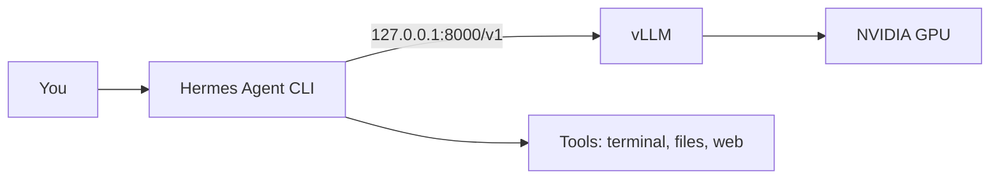
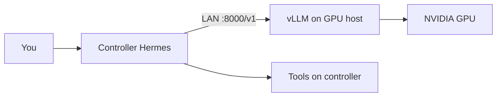

# Enodios

**Ἐνόδιος — Hermes of the road.** One-script Linux setup to run [Hermes Agent](https://github.com/NousResearch/hermes-agent) on **your own GPU** via [vLLM](https://github.com/vllm-project/vllm).

No cloud API keys for inference. Fast tool calling. Uncensored agent models.

**Documentation site:** https://dataknifeai.github.io/enodios/

---

## What it does

```
You ──► Hermes Agent (tools, files, terminal, web)
              │
              │  OpenAI-compatible API
              ▼
         vLLM on your GPU (Hermes 3, tool-call parser)
```

Enodios installs and wires the stack:

1. **vLLM** — high-throughput local inference on NVIDIA GPUs (native, no Docker required)
2. **Hermes Agent** — agentic CLI you already use; pointed at `http://127.0.0.1:8000/v1`
3. **Defaults tuned for agent work** — AWQ Hermes 3 8B, `--tool-call-parser hermes`, **64k context** (Hermes minimum)

Benchmarked on RTX 4090: **~2s tool-call latency** (vLLM) vs **~7s** (Ollama) for the same model class.

---

## Requirements

### Hardware

| Component | Minimum | Recommended |
|-----------|---------|-------------|
| **GPU** | NVIDIA, 12GB+ VRAM | RTX 3090/4080/4090 (24GB) |
| **Free VRAM** | ~14GB (AWQ 8B + 64k KV) | ~18GB+ with desktop/apps open |
| **RAM** | 16GB | 32GB+ |
| **Disk** | 15GB free | 30GB+ (model cache + vLLM venv) |

### Software

| Requirement | Notes |
|-------------|-------|
| **Linux** | x86_64. Arch, Ubuntu, Fedora, etc. |
| **NVIDIA driver** | `nvidia-smi` must work |
| **curl, git** | For bootstrap |
| **Hermes Agent** | [Install separately](https://github.com/NousResearch/hermes-agent) if not already present |
| **Python 3.12** | Installed automatically via `uv` — system Python 3.14+ is not used |
| **CUDA toolkit** | Optional (`pacman -S cuda` / `nvidia-cuda-toolkit`). Speeds up sampling; not required |

### What Enodios installs for you

- [uv](https://github.com/astral-sh/uv) — Python environment manager
- **vLLM** + PyTorch CUDA wheels in `~/.local/share/enodios/.venv`
- **`enodios` CLI** → `~/.local/bin/enodios`

### Network

- **HuggingFace** access for first model download (no token needed for public AWQ weights)
- **No** ongoing cloud inference dependency

---

## Quick start (5 minutes)

### 1. Install Hermes Agent (if needed)

```bash
curl -fsSL https://raw.githubusercontent.com/NousResearch/hermes-agent/main/scripts/install.sh | bash
hermes setup   # walk through initial config; you can change model after
```

### 2. Install Enodios + vLLM

```bash
curl -fsSL https://raw.githubusercontent.com/DataKnifeAI/enodios/main/install.sh | bash
enodios install
```

First `install` downloads ~2GB of Python wheels. Subsequent runs are fast.

### 3. Verify GPU + get tuned settings

```bash
enodios recommend    # detect VRAM → suggested ENODIOS_* exports
enodios doctor
```

Expect:

- `nvidia-smi` shows your GPU
- `torch ... cuda True`
- `OK: .../enodios/.venv/bin/vllm`

Optional: persist recommendations:

```bash
enodios recommend --apply
source ~/.local/share/enodios/recommended.env
```

### 4. Start inference

```bash
enodios start -b     # background (logs: ~/.local/share/enodios/vllm.log)
```

vLLM binds **127.0.0.1** by default (loopback only). Wait until ready (30–90s first time), then:

```bash
enodios status
enodios bench
```

Foreground instead: `enodios start` (Ctrl+C to stop).

### 5. Wire Hermes

```bash
enodios configure
hermes chat
```

`configure` backs up `~/.hermes/config.yaml` and sets:

```yaml
model:
  default: hermes3:8b
  provider: custom:enodios
  context_length: 65536
custom_providers:
  - name: enodios
    base_url: http://127.0.0.1:8000/v1
    models:
      hermes3:8b:
        context_length: 65536
```

### 6. Stop when done

```bash
enodios stop
```

---

## Commands

| Command | Description |
|---------|-------------|
| `enodios install` | Create venv, install vLLM, link CLI |
| `enodios recommend` | Detect GPU VRAM → model/settings for Hermes |
| `enodios recommend --apply` | Write `~/.local/share/enodios/recommended.env` |
| `enodios start` | Run vLLM foreground on loopback |
| `enodios start -b` | Background; log + PID under `~/.local/share/enodios/` |
| `enodios start --lan` | Bind `0.0.0.0` for LAN access (opt-in; no API auth) |
| `enodios stop` | Stop vLLM for this stack |
| `enodios urls` | Print local + LAN API URLs |
| `enodios doctor` | GPU, CUDA, venv, endpoint health |
| `enodios bench` | Tool-call latency smoke test |
| `enodios configure` | Point Hermes at `http://127.0.0.1:8000/v1` |
| `enodios configure --url URL` | Point Hermes at a remote vLLM endpoint |
| `enodios status` | Query `/v1/models` + URLs |

---

## Distributed Hermes (Hermes controlling Hermes)

Run vLLM on a GPU host; run the orchestrating Hermes agent on another machine on the same LAN.

**GPU host** (inference server):

```bash
enodios start -b --lan
enodios urls    # copy the LAN URL
```

**Controller** (Hermes agent with tools):

```bash
enodios configure --url http://<gpu-host>:8000/v1
hermes chat
```

vLLM has **no API authentication**. Use `--lan` only on a trusted local network.

---

## Defaults

| Setting | Value |
|---------|-------|
| Model weights | `solidrust/Hermes-3-Llama-3.1-8B-AWQ` |
| API model name | `hermes3:8b` |
| Bind address | `127.0.0.1` (loopback; use `start --lan` for LAN) |
| Port | `8000` |
| Context length | `65536` (Hermes agent minimum) |
| KV cache | `fp8` |
| GPU memory cap | `75%` of VRAM |
| Venv | `~/.local/share/enodios/.venv` |
| Background log | `~/.local/share/enodios/vllm.log` |

### Environment overrides

```bash
export ENODIOS_PORT=8000
export ENODIOS_MODEL=solidrust/Hermes-3-Llama-3.1-8B-AWQ
export ENODIOS_GPU_UTIL=0.85        # if GPU is idle
export ENODIOS_MAX_MODEL_LEN=65536  # default; lower only if VRAM OOM
export ENODIOS_KV_CACHE_DTYPE=fp8   # set auto if quality issues
export ENODIOS_VENV=$HOME/.local/share/enodios/.venv
export ENODIOS_LOG=$HOME/.local/share/enodios/vllm.log
```

---

## Recommended models (Hermes Agent + tools + uncensored)

| Model | VRAM | Tools | Uncensored | Notes |
|-------|------|-------|------------|-------|
| **Hermes 3 8B AWQ** (default) | ~20GB @ 64k | ✅ | ✅ | Best balance; enodios default |
| `NousResearch/Hermes-3-Llama-3.1-8B` (BF16) | ~16GB+ weights | ✅ | ✅ | Higher quality; needs free VRAM |
| `vatistasdim/Cipher-Abliterated` | ~4GB | ✅ | ✅ | Fastest; smaller model |
| Ollama `hermes3:8b` | ~5GB weights | ✅ | ✅ | Fallback; slower than vLLM |

Aligned models (censored) with strong tools: `nemotron-3-nano`, `qwen3.6` — use Ollama or vLLM separately if you prefer those.

---

## Troubleshooting

### `Free memory ... less than desired GPU memory utilization`

64k context uses **~20GB VRAM** on a 4090. Close games, Ollama, etc. before starting.

```bash
enodios stop
# close GPU-heavy apps, then:
enodios start
# or lower cap if needed:
export ENODIOS_GPU_UTIL=0.65
enodios start
```

Enodios uses `--kv-cache-dtype fp8` by default to fit 64k on 24GB cards. Disable with `ENODIOS_KV_CACHE_DTYPE=auto` if you hit quality issues.

### `Could not find nvcc`

Harmless with default settings. Enodios uses PyTorch sampler fallback. For optional speedup:

```bash
# Arch/CachyOS example
sudo pacman -S cuda
export CUDA_HOME=/opt/cuda
export PATH="$CUDA_HOME/bin:$PATH"
```

### `vLLM not running on port 8000`

```bash
enodios start -b
tail -f ~/.local/share/enodios/vllm.log
# or check conflict:
ss -ltnp | grep 8000
```

### Remote Hermes cannot reach vLLM

GPU host must use LAN mode; controller needs the LAN URL:

```bash
# on GPU host
enodios start -b --lan
enodios urls

# on controller
enodios configure --url http://<gpu-host>:8000/v1
```

Ensure firewall allows TCP port `8000` on the GPU host.

### Hermes connects but no tool calls

Ensure vLLM started with Hermes parser (enodios does this automatically):

```bash
--enable-auto-tool-choice --tool-call-parser hermes
```

### Docker vLLM / NIM `CUDA_ERROR_UNKNOWN`

Use **native** enodios (host vLLM). This path avoids Docker CUDA issues seen on some setups.

---

## Architecture

**Single machine** (default):



**Distributed** (optional `start --lan`):



---

## Why "Enodios"?

**Enodios** (Ἐνόδιος) is a Greek epithet of Hermes — god of **roads, travelers, and crossroads**. This project is the local road between Hermes Agent and your GPU.

The name is unused in open source (0 PyPI/npm collisions when we picked it).

---

## Development

```bash
git clone https://github.com/DataKnifeAI/enodios.git
cd enodios
./bin/enodios install
```

---

## License

MIT — see [LICENSE](LICENSE).
