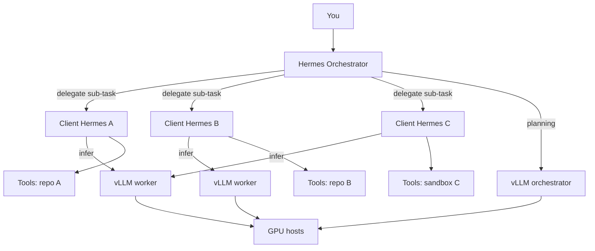
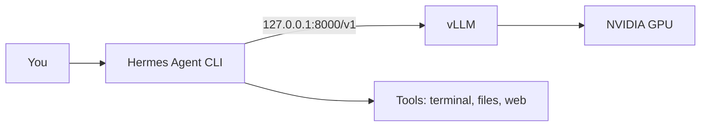
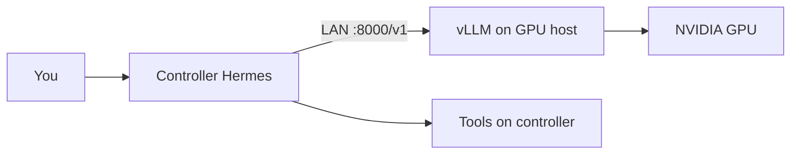
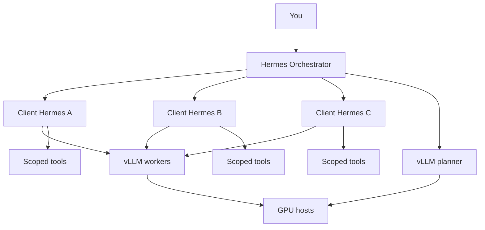

# Enodios — Advanced setup & reference

Full guide for Hermes wiring, distributed setups, tuning, and troubleshooting.

**Docs site:** https://dataknifeai.github.io/enodios/  
**Quick start:** [README](../README.md)

---

## Requirements

### Hardware

| Component | Minimum | Recommended |
|-----------|---------|-------------|
| **GPU** | NVIDIA, 12GB+ VRAM | RTX 3090/4080/4090 (24GB) |
| **Free VRAM** | ~14GB (AWQ 8B + 64k KV) | ~18GB+ with desktop/apps open |
| **RAM** | 16GB | 32GB+ |
| **Disk** | 15GB free | 30GB+ (model cache + vLLM venv) |

### Software

| Requirement | Notes |
|-------------|-------|
| **Linux** | x86_64. Arch, Ubuntu, Fedora, etc. |
| **NVIDIA driver** | `nvidia-smi` must work — `enodios deps` checks and can install |
| **curl, git** | For bootstrap — installed by `enodios deps` if missing |
| **Hermes Agent** | Install **after** Enodios — vLLM must be up before `hermes setup` |
| **Python 3.14** | Installed via `uv` automatically (`ENODIOS_PYTHON` to override) |
| **CUDA toolkit** | Optional. Speeds up sampling; not required |

### What Enodios installs

- [uv](https://github.com/astral-sh/uv) — Python environment manager
- **vLLM** + PyTorch CUDA in `~/.local/share/enodios/.venv`
- **`enodios` CLI** → `~/.local/bin/enodios`

### Network

- **HuggingFace** for first model download (no token for public AWQ weights)
- **No** ongoing cloud inference dependency

### OS dependencies (`enodios deps`)

Checks and optionally installs:

- **Required:** `curl`, `git`, NVIDIA driver (`nvidia-smi` working)
- **Optional:** CUDA toolkit (`nvcc`) for FlashInfer speedup
- **Package managers:** `pacman`, `apt`, `dnf`, `yum`, `zypper` (auto-detected)

```bash
enodios deps           # check + prompt to install
enodios deps --check   # exit 1 if required deps missing
enodios deps --install # install without prompting (sudo)
```

`enodios install` runs the same check first. Skip prompts: `ENODIOS_DEPS=skip`. Auto-install: `ENODIOS_DEPS=allow`.

NVIDIA driver install may require a **reboot** before `nvidia-smi` works.

---

## Connect Hermes via CLI wizard

Install **Enodios and start vLLM first**, then install Hermes.

### Prerequisites

```bash
enodios start -b
enodios status    # should list hermes3:8b
enodios bench     # tool-call smoke test
```

```bash
curl -fsSL https://raw.githubusercontent.com/NousResearch/hermes-agent/main/scripts/install.sh | bash
```

### Setup path (first install)

```bash
hermes setup
```

1. **How would you like to set up Hermes?** → **Full setup** (skip Quick Setup / Nous Portal)
2. At **Inference Provider** → **Custom endpoint (enter URL manually)**
3. Enter values below; press Enter through later sections or configure later

Shortcut (provider only):

```bash
hermes setup model
# or: hermes model
```

### `hermes model` vs `/model`

| Command | Where | Purpose |
|---------|-------|---------|
| **`hermes setup`** → Full setup → Inference Provider | Install / reconfigure | Full wizard |
| **`hermes setup model`** / **`hermes model`** | Shell (outside chat) | Provider picker only |
| **`/model`** | Inside `hermes chat` | Switch existing providers only |

### Wizard values (same machine)

| Prompt | Value |
|--------|-------|
| Provider | **Custom endpoint (enter URL manually)** |
| Base URL | `http://127.0.0.1:8000/v1` |
| API key | Leave empty |
| Model name | `hermes3:8b` |
| Context length | `65536` |
| Provider name | `enodios` (optional) |

Hermes may probe `/v1/models`. If vLLM is still loading, wait and re-run `hermes setup model`.

### Verify

```bash
hermes config show
hermes chat
```

Expected config snippet:

```yaml
model:
  default: hermes3:8b
  provider: custom:enodios
  context_length: 65536
custom_providers:
  - name: enodios
    base_url: http://127.0.0.1:8000/v1
    models:
      hermes3:8b:
        context_length: 65536
```

In chat, switch provider:

```
/model custom:enodios:hermes3:8b
```

### Wizard vs `enodios configure`

| Method | Best for |
|--------|----------|
| **`hermes setup`** (Full setup) | First install |
| **`hermes setup model`** / **`hermes model`** | Reconfigure provider |
| **`enodios configure`** | Quick local overwrite |
| **`enodios configure --url`** | Remote GPU host on controller |

`enodios configure` backs up `~/.hermes/config.yaml` before editing.

### Wizard troubleshooting

| Problem | Fix |
|---------|-----|
| Endpoint probe fails | `enodios status`; `tail -f ~/.local/share/enodios/vllm.log` |
| Wrong model name | Use `hermes3:8b` |
| Context too small | Set **65536** |
| No tool calls | `enodios bench` must pass |
| `/model` missing Enodios | Run `hermes setup model` first |
| Picked Quick Setup | Re-run → Full setup → Custom |
| Remote unreachable | `enodios start --lan` + `enodios firewall --allow` |

---

## Distributed Hermes

vLLM on a GPU host; Hermes with tools on another machine (same LAN).

**GPU host:**

```bash
enodios start -b --lan
enodios urls    # copy lan: URL
```

**Controller:**

```bash
hermes setup model
# Custom endpoint → http://<gpu-host>:8000/v1
# model: hermes3:8b  context: 65536

# or:
enodios configure --url http://<gpu-host>:8000/v1
hermes chat
```

vLLM has **no API authentication**. Use `--lan` only on a trusted network.

`enodios start --lan` detects UFW/firewalld and prompts to open TCP 8000. Or: `enodios firewall --allow`.

---

## Orchestrator + sub-agents

One **orchestrator** Hermes plans work and delegates **sub-agent** Hermes clients — each client runs scoped tools on its own machine while sharing Enodios vLLM endpoints.



**Typical layout**

| Role | Machine | Enodios |
|------|---------|---------|
| Orchestrator | Your laptop / controller | `enodios configure` → local or remote planner vLLM |
| Client A, B, … | Per repo, VM, or teammate box | `enodios configure --url http://<gpu-host>:8000/v1` |
| GPU host(s) | Inference server(s) | `enodios start -b --lan` on each |

The orchestrator breaks goals into parallel sub-tasks; each client Hermes gets a narrow tool scope (one repo, one container, one directory tree). Clients can share one vLLM host or fan out across several Enodios instances on different GPUs.

**Setup sketch**

```bash
# GPU host
enodios start -b --lan && enodios urls

# Orchestrator machine
enodios configure --url http://<gpu-host>:8000/v1
hermes chat   # plans and delegates

# Each client machine (sub-agent)
enodios configure --url http://<gpu-host>:8000/v1   # or a second GPU host
hermes chat   # scoped tools for its sub-task
```

Use separate Hermes configs/providers per client if you want different `base_url` or model names. vLLM has no auth — keep `--lan` on trusted networks only.

---

## Defaults & environment

| Setting | Value |
|---------|-------|
| Model weights | `solidrust/Hermes-3-Llama-3.1-8B-AWQ` |
| API model name | `hermes3:8b` |
| Bind address | `127.0.0.1` (`start --lan` → `0.0.0.0`) |
| Port | `8000` |
| Context length | `65536` |
| KV cache | `fp8` |
| GPU memory cap | `75%` |
| Venv | `~/.local/share/enodios/.venv` |
| Log | `~/.local/share/enodios/vllm.log` |

```bash
export ENODIOS_PYTHON=3.14
export ENODIOS_PORT=8000
export ENODIOS_MODEL=solidrust/Hermes-3-Llama-3.1-8B-AWQ
export ENODIOS_GPU_UTIL=0.85
export ENODIOS_MAX_MODEL_LEN=65536
export ENODIOS_KV_CACHE_DTYPE=fp8   # auto if quality issues
export ENODIOS_VENV=$HOME/.local/share/enodios/.venv
export ENODIOS_LOG=$HOME/.local/share/enodios/vllm.log
export ENODIOS_UPDATE_CHECK=skip    # disable update notice on start
export ENODIOS_FIREWALL=allow         # auto-open firewall on --lan
```

### Updates

```bash
enodios update
```

Pulls git, upgrades vLLM, refreshes CLI. `enodios start` checks for updates every 6h (configurable via `ENODIOS_UPDATE_CHECK_INTERVAL`).

---

## Recommended models

| Model | VRAM | Tools | Uncensored | Notes |
|-------|------|-------|------------|-------|
| **Hermes 3 8B AWQ** (default) | ~20GB @ 64k | ✅ | ✅ | Best balance |
| `NousResearch/Hermes-3-Llama-3.1-8B` (BF16) | ~16GB+ weights | ✅ | ✅ | Higher quality |
| `vatistasdim/Cipher-Abliterated` | ~4GB | ✅ | ✅ | Fastest; smaller |
| Ollama `hermes3:8b` | ~5GB weights | ✅ | ✅ | Fallback; slower |

Aligned (censored) with strong tools: `nemotron-3-nano`, `qwen3.6` — run via Ollama or separate vLLM.

---

## Troubleshooting

### Gaming or heavy GPU apps

```bash
enodios stop    # or: enodios pause — frees ~20GB VRAM
# game / render / train
enodios start -b
```

Hermes config is unchanged; only vLLM stops.

### `Free memory ... less than desired GPU memory utilization`

64k uses **~20GB VRAM** on a 4090. Stop other GPU apps first:

```bash
enodios stop
export ENODIOS_GPU_UTIL=0.65
enodios start -b
```

### `Could not find nvcc`

Harmless — PyTorch sampler fallback is used. Optional speedup:

```bash
sudo pacman -S cuda   # Arch example
export CUDA_HOME=/opt/cuda
export PATH="$CUDA_HOME/bin:$PATH"
```

### vLLM not running

```bash
enodios start -b
tail -f ~/.local/share/enodios/vllm.log
ss -ltnp | grep 8000
```

### Remote Hermes cannot reach vLLM

```bash
# GPU host
enodios start -b --lan
enodios firewall --allow
enodios urls

# controller
enodios configure --url http://<gpu-host>:8000/v1
```

### Hermes connects but no tool calls

Enodios sets `--enable-auto-tool-choice --tool-call-parser hermes` automatically. Run `enodios bench`.

### Docker vLLM `CUDA_ERROR_UNKNOWN`

Use native Enodios (host vLLM), not Docker.

---

## Architecture

**Single machine:**



**Distributed (`start --lan`):**



**Orchestrator + sub-agents:**



---

## Development

```bash
git clone https://github.com/DataKnifeAI/enodios.git
cd enodios
./bin/enodios install
ln -sf "$(pwd)/bin/enodios" ~/.local/bin/enodios
```

---

## Why "Enodios"?

**Enodios** (Ἐνόδιος) — Greek epithet of Hermes, god of roads and crossroads. The local path between Hermes Agent and your GPU.
